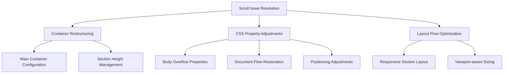
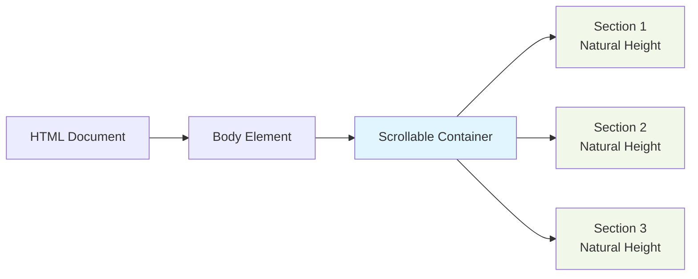

# Scroll Issue Resolution Design

## Overview

The portfolio website currently behaves like a "card" instead of scrolling properly. Users are unable to scroll through the different sections of the page, which impacts usability and accessibility. This design document outlines the root causes of the issue and provides a strategic solution to implement proper scrolling behavior.

The issue manifests as a page that appears to be contained within a fixed viewport, preventing users from accessing content below the initial view. This creates a frustrating user experience where navigation becomes impossible.

## Root Cause Analysis

After analyzing the portfolio HTML structure, several issues contribute to the scrolling problem:

1. **Improper Container Structure**: The page lacks a proper scrollable container structure that allows content to extend beyond the viewport height
2. **CSS Overflow Properties**: Incorrect overflow settings on the body and main container elements
3. **Fixed Positioning Issues**: Some elements may have positioning that interferes with natural document flow
4. **Height Constraints**: Sections may have fixed or constrained heights that prevent natural scrolling
5. **Viewport Height Misuse**: Extensive use of `vh` units that constrain content to viewport height
6. **Sticky Header Implementation**: The header positioning may interfere with natural scroll behavior

## Proposed Solution Architecture

### Document Flow Visualization

## Technical Design

### 1. Container Structure Improvements

The main issue stems from the lack of a proper document flow that allows natural scrolling. The solution involves:

- Implementing a single scrollable container for all content
- Ensuring sections expand naturally based on content
- Removing artificial height constraints that prevent scrolling
- Replacing viewport-height based sizing with content-based sizing

### 2. CSS Property Adjustments

Several CSS properties need modification to restore proper scrolling:

| Element | Current Issue | Required Change | Purpose |
|---------|---------------|-----------------|---------|
| body | `overflow-x: hidden` without proper overflow-y | Add `overflow-y: auto` | Enable vertical scrolling |
| .container | Fixed height constraints | Remove fixed height properties | Allow natural content expansion |
| header | Fixed positioning without scroll awareness | Implement scroll-aware positioning | Prevent header interference with content |
| section | Height constrained to viewport | Allow natural height based on content | Enable content scrolling |
| html | Possible height restrictions | Ensure full document height | Support proper scrolling |

#### Specific CSS Modifications Required:

1. **Body Element**:
   - Current: `overflow-x: hidden;`
   - Change to: `overflow-x: hidden; overflow-y: auto;`
   - Reason: Enable vertical scrolling while maintaining horizontal constraint

2. **HTML Element**:
   - Current: Possibly restricted height
   - Change to: `height: 100%;` or remove height constraints
   - Reason: Ensure document can expand to accommodate all content

3. **Section Elements**:
   - Current: May use `vh` units constraining height
   - Change to: Use natural content-based height
   - Reason: Allow sections to expand based on content

### 3. Layout Flow Optimization

The layout needs restructuring to ensure content flows naturally:

- Replace fixed positioning with relative positioning where appropriate
- Ensure all sections contribute to document height
- Implement proper margin and padding handling for scrollable content
- Maintain visual design while enabling proper document flow

## Implementation Strategy

### Phase 1: Container Restructuring
1. Review and modify the main document structure
2. Ensure all sections are part of the natural document flow
3. Remove any artificial height constraints on the body or main container
4. Replace viewport-height units with relative units where appropriate

### Phase 2: CSS Property Adjustments
1. Modify overflow properties to enable vertical scrolling
2. Adjust positioning properties to maintain visual design while enabling scroll
3. Update height properties to allow content-based sizing
4. Ensure proper document height inheritance

### Phase 3: Layout Flow Optimization
1. Ensure all sections contribute to document scroll height
2. Implement responsive sizing that works with scrolling
3. Verify cross-browser compatibility of scroll behavior
4. Test interaction between sticky header and scrolling content

## Expected Outcomes

After implementing the proposed solution:

1. **Proper Scrolling**: Users will be able to scroll through all sections of the portfolio
2. **Responsive Design**: The layout will adapt to different viewport sizes while maintaining scroll functionality
3. **Visual Consistency**: The aesthetic design will be preserved while enabling proper interaction
4. **Accessibility**: Keyboard navigation and screen readers will work correctly with the scrollable content
5. **Performance**: Scrolling performance will be smooth without layout thrashing
6. **Cross-browser Compatibility**: Scroll behavior will work consistently across modern browsers

## Testing Approach

### Unit Testing
- Verify overflow properties are correctly applied
- Confirm document height reflects total content height
- Test positioning behavior during scroll events
- Validate CSS property changes with developer tools

### Integration Testing
- Validate scroll behavior across different viewport sizes
- Ensure navigation links still work correctly
- Test performance impact of scroll implementation
- Verify sticky header behavior during scrolling

### User Experience Testing
- Verify smooth scrolling experience on different devices
- Confirm all content is accessible through scrolling
- Test interaction with fixed elements (header, navigation)
- Validate keyboard navigation and screen reader compatibility

### Verification Metrics
- Document height should equal sum of all section heights
- Scrollbar should be visible when content exceeds viewport
- All navigation anchors should scroll to correct positions
- Header should maintain proper positioning during scroll